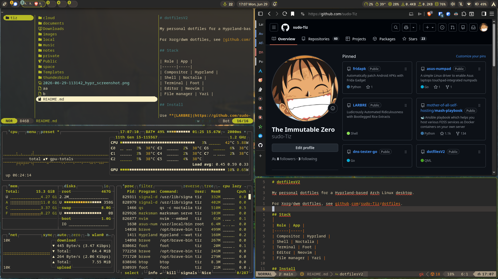

# dotfilesV2

My personal dotfiles for a Hyprland-based Arch Linux desktop.

 

For Xorg/dwm dotfiles, see [github.com/sudo-Tiz/dotfiles](https://github.com/sudo-Tiz/dotfiles).

## Stack

| Role | App |
|------|-----|
| Compositor | Hyprland |
| Shell | Noctalia |
| Terminal | Foot |
| Editor | Neovim |
| File manager | Yazi |

## Install

Use **[LARBRE](https://github.com/sudo-Tiz/LARBRE)** for a full automated setup on a fresh Arch install.

```bash
git clone --recursive https://github.com/sudo-Tiz/dotfilesV2.git
```

Files go in `~/.config/`. Environment variables in `~/.zprofile` keep the home directory clean.

## Theming

Colors are managed by **Noctalia**. Changing the theme in Noctalia settings automatically propagates to all apps (terminal, GTK, Qt, etc.)

## Keybindings

Press `Super + Shift + A` to open the keybind cheatsheet.
